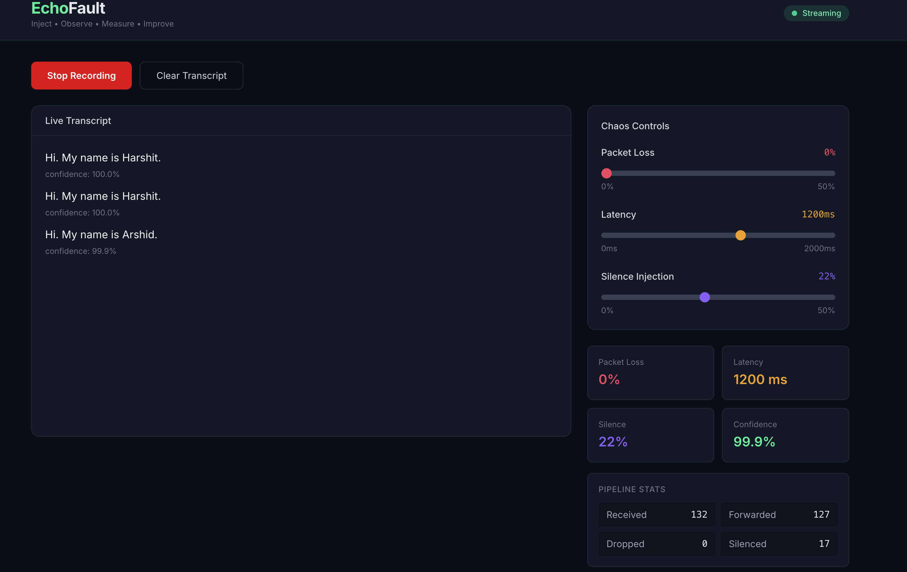

# EchoFault

> **Inject • Observe • Measure • Improve**

EchoFault is a chaos engineering platform for Voice AI. It intentionally injects controlled failures into live audio streams and measures how they affect transcription quality, latency, and confidence — helping teams evaluate the resilience of streaming speech-to-text systems under realistic adverse network conditions.

Think of it as **Chaos Monkey for Voice AI**.


*Live transcription with chaos controls — packet loss, latency, and silence injection sliders with real-time pipeline metrics.*

---

## Motivation

Voice AI systems are deployed in unpredictable real-world conditions: spotty Wi-Fi, mobile networks, packet loss, and latency spikes. Most development and testing happens under ideal conditions, leaving teams blind to how their systems degrade under stress.

EchoFault closes that gap by providing a controlled environment to:

- **Inject** packet loss, latency, and silence into live audio streams
- **Observe** real-time transcription changes as conditions shift
- **Measure** confidence scores and pipeline metrics
- **Improve** system resilience with data-driven insights

---

## Architecture

```
Browser (Microphone)
        │
        ▼
Spring Boot WebSocket Proxy
        │
        ▼
Audio Pipeline
        │
        ├── Packet Loss Rule
        ├── Latency Rule
        └── Silence Rule
        │
        ▼
Deepgram Streaming API
        │
        ▼
Live Transcript
        │
        ▼
React Dashboard
```

See [docs/ARCHITECTURE.md](docs/ARCHITECTURE.md) for detailed component documentation.

---

## Technologies

| Layer | Stack |
|-------|-------|
| Backend | Java 21, Spring Boot 3, Maven, WebSocket |
| Frontend | React, TypeScript, Vite, TailwindCSS |
| Voice | Deepgram Streaming Speech-to-Text API |
| Deployment | Docker, Docker Compose |

---

## Prerequisites

- **Java 21** (for local backend development)
- **Node.js 20+** (for local frontend development)
- **Maven 3.9+**
- **Docker & Docker Compose** (for containerized deployment)
- **Deepgram API Key** — [Get one free](https://console.deepgram.com/)

---

## Quick Start (Docker)

1. Clone the repository and set your API key:

```bash
cp .env.example .env
# Edit .env and set DEEPGRAM_API_KEY
```

2. Start everything:

```bash
docker compose up --build
```

3. Open [http://localhost:3000](http://localhost:3000), grant microphone access, and start recording.

---

## Running Locally

### Backend

```bash
cd backend
export DEEPGRAM_API_KEY=your_key_here
mvn spring-boot:run
```

The backend starts on [http://localhost:8080](http://localhost:8080).

### Frontend

```bash
cd frontend
npm install
npm run dev
```

The frontend starts on [http://localhost:5173](http://localhost:5173) with API/WebSocket proxy to the backend.

---

## Usage

1. Open the dashboard in your browser.
2. Click **Start Recording** and grant microphone access.
3. Speak into your microphone — live transcripts appear in real time.
4. Adjust the chaos sliders:
   - **Packet Loss** (0–50%) — randomly drops audio packets
   - **Latency** (0–2000 ms) — delays outgoing packets
   - **Silence Injection** (0–50%) — replaces packets with silence
5. Watch how transcript quality and confidence change under degraded conditions.

---

## Project Structure

```
EchoFault/
├── backend/
│   ├── src/main/java/com/deepgram/echofault/
│   │   ├── config/          # Spring configuration
│   │   ├── controller/      # REST endpoints
│   │   ├── deepgram/        # Deepgram WebSocket client
│   │   ├── metrics/         # Stream counters
│   │   ├── model/           # Data models
│   │   ├── pipeline/        # Audio pipeline orchestration
│   │   ├── rules/           # Chaos injection rules
│   │   └── websocket/       # Browser WebSocket handler
│   └── Dockerfile
├── frontend/
│   ├── src/
│   │   ├── components/      # UI components
│   │   ├── hooks/           # React hooks
│   │   ├── pages/           # Dashboard page
│   │   ├── services/        # WebSocket & audio services
│   │   └── types/           # TypeScript types
│   └── Dockerfile
├── docs/
│   └── ARCHITECTURE.md
├── docker-compose.yml
└── README.md
```

---

## API Endpoints

| Endpoint | Method | Description |
|----------|--------|-------------|
| `/api/health` | GET | Health check |
| `/ws/audio` | WebSocket | Audio streaming + control |

---

## Future Roadmap

These features are planned but not yet implemented:

- Background noise injection
- Echo simulation
- Network jitter
- Audio clipping
- Word Error Rate (WER) calculation
- Side-by-side clean vs. degraded comparison
- OpenTelemetry integration
- Grafana dashboards
- Prometheus metrics
- Kubernetes deployment
- Multi-provider benchmarking (Deepgram, Google, AWS, etc.)

---

## License

Internal engineering tool — Deepgram proof of concept.
